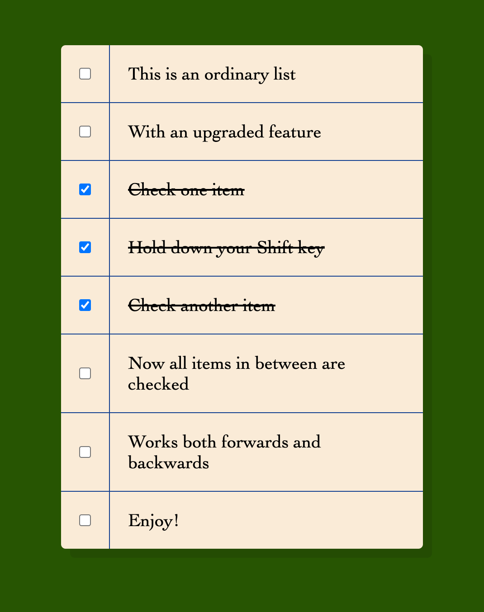

# Holding Shift to Check Multiple Checkboxes: Vanilla JS

## Table of Contents

- [Description](#description)
- [Usage](#usage)
- [Credits](#credits)
- [License](#license)

## Description

This is an ordinary list with an upgraded feature: check multiple list items at once while holding the shift key. Created with only Vanilla JavaScript.

## Usage

## Credits

Wes Bos's Vanilla JavaScript 30 Day Challenge
https://javascript30.com/

## License

No licenses (default copyright laws apply).

---
